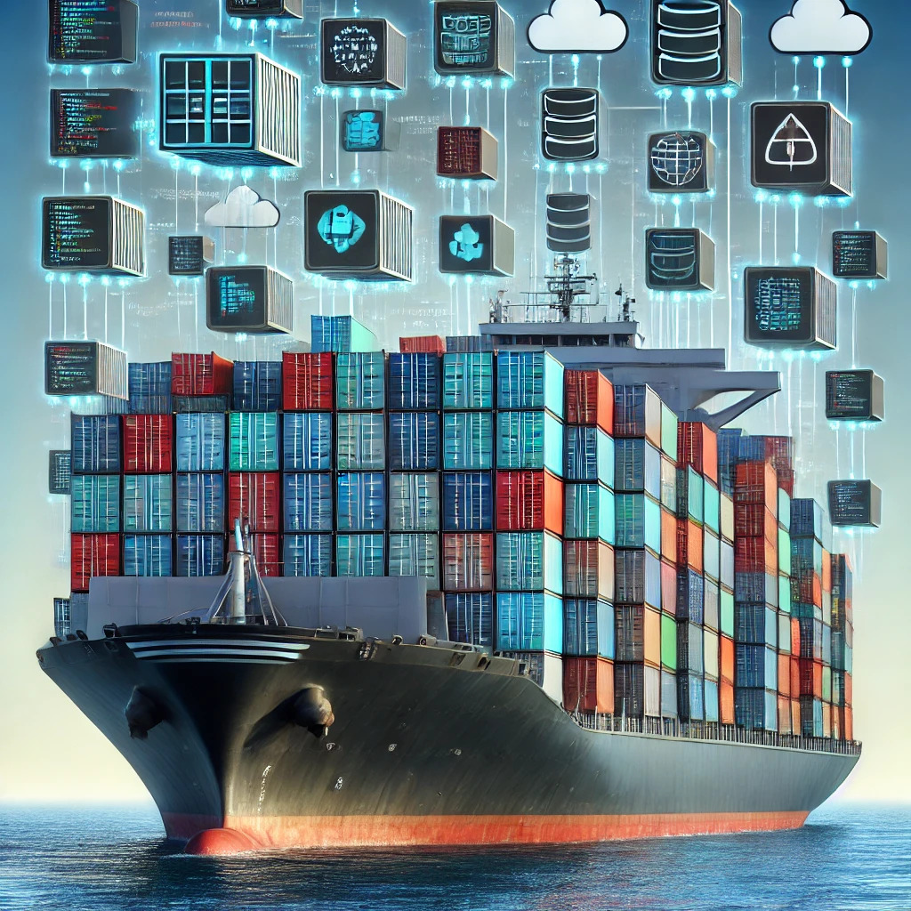
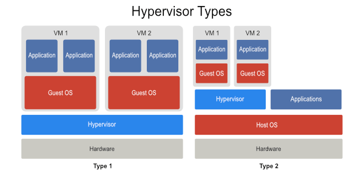
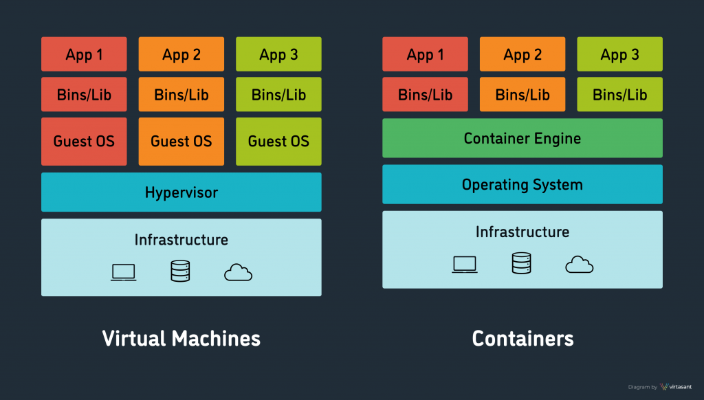
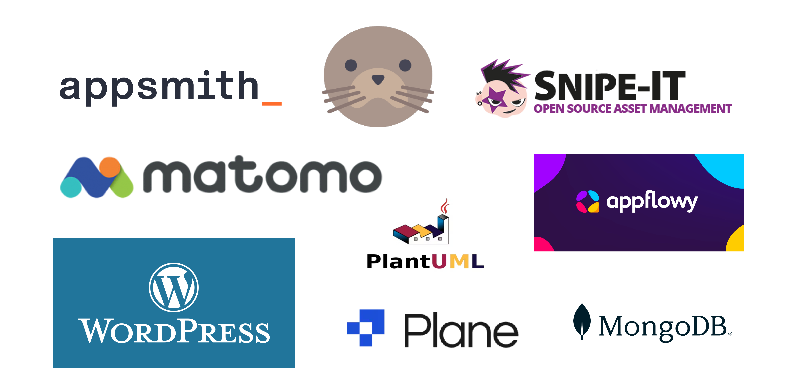

<!--
_class: lead
header: ''
footer: ''
_paginate: false
-->

<style>
   :root {
      font-size: 24px;
      /* background-image: url("./assets/containers.jpg") */
   }
   /* @keyframes point-up {
      from { background-position: 50px 50px; }
      to { background-position: 50px 70px; }
   }
   @keyframes point-down {
      from { background-position: left 50px bottom 50px; }
      to { background-position: left 50px bottom 70px; }
   } */
   section {
      /* animation: 0.5s ease-in-out alternate infinite point-up;
      background: url('https://icongr.am/feather/arrow-up.svg?color=0288d1') no-repeat 50px 50px / 80px; */
      justify-content: start;    
   }
   /* section::before {
      content: '';
      display: block;
      position: absolute;
      top: 0;
      left: 0;
      right: 0;
      bottom: 0;
      pointer-events: none;
      animation: 0.5s ease-in-out alternate infinite point-down;
      background: transparent url('https://icongr.am/feather/arrow-down.svg?color=0288d1') no-repeat left 50px bottom 50px / 80px;
   } */
   /* @media (prefers-reduced-motion) {
      section, section::before {
         animation: none;
      }
   } */
   img[alt~="center"] {
      display: block;
      margin: 0 auto;
   }
   .columns {
      display: grid;
      grid-template-columns: repeat(2, minmax(0, 1fr));
      gap: 1rem;
   }
   section {
   }
   /* Add "Page" prefix and total page number */
   section::after {
      font-size: 66% !important;
      /* font-weight: bold; */
      /* text-shadow: 1px 1px 0 #fff; */
      content: 'Page ' attr(data-marpit-pagination) ' / ' attr(data-marpit-pagination-total);
   }
</style>

<style scoped>
section {
   justify-content: center;
}
</style>
# <!-- fit -->Containerization

_from virtualization to isolation_



<!-- 
 -->

<!--
- Welcome
-->
---
<!--
_theme: gaia
header: '</img>'
footer: 'Containerization - _from virtualization to isolation_'
# paginate: true
-->

<!-- Scoped style -->

<style scoped>
/* section {
  background: transparent;
} */
</style>

## Agenda

<ol>
   <li>History of virtualization</li>
   <li>Virtual Machines vs. Containers</li>
   <li>What are Containers?</li>
   <li>Container Architecture</li>
   <li>Containers & Benefits</li>
   <li>Containers & Security</li>
   <li>Orchestration and Scaling</li>
   <li>Challenges and considerations</li>
</ol>

---

## History of virtualization

- Need for virtualization, to increase efficiency and reduce cost
- Hypervisors, the technology that enables 'virtualization'
- Sourced back to 1960 (IBM)
- Widly adopted since early 2000s, when multi-core CPU's where introduced
- Partition servers to run multiple virtual machines
- Legacy apps can run on multiple operating systems and versions
- ex.: VMWare ESXI, RHEL, SUSE, Xen, Hyper-V, KVM, Proxmox, OpenStack

<!--
- Tot de jaren 90 kochten bedrijven meestal ook nieuwe hardware aan wanneer zij een nieuw sofwarepakket indienst namen, soms gedwongen omdat de leverancier van de software ook specifieke hardware vereisten oplegden, anderzijds doelbewust om de taken op de individele servers duidelijk van elkaar te onderscheiden
- In de begin jaren 2000 kwam daar verandering in met het adopteren van virtualisatie technologie, hoewel dit al bestond van in 1960, ontwikkeld door IBM.
- De technologie die dit mogelijk maakt noemen we ook wel 'hypervisors' en bood de mogelijkheid om bestaande servers op te splitsen in meerdere virtuele machines en liet ook toe om bestaande applicaties op verschillende types en versies van besturingssytemen te laten draaien die onderliggens dezelfde hardware delen, zoals werkgeheugen, rekenkracht (processoren) en opslag. Zo werden servers efficiënter gebruikt en kon men de kosten rond de aankoop, opzet en onderhoud drastisch verminderen.
-->

---

## How does virtualization work?

- A hypervisor separates the physical resources from the virtual environments
   - on top of an operating system (Type 2)
   - or installed directly on bare metal (Type 1) - commenly used
- Computation and interactions happens within the virtual environment (VM)
- When additional resources are required due to a heavy workload, the hypervisor relays the request to the physical machine at close to native speed.
- Benefits:
   - Resource optimization (sharing virtualized hardware)
   - Consolidation (from dedicated servers to single server running multiple virtual environments)
   - VM's can be moved from one server to another.
   - Cost reduction (investment, setup, maintenance, ...)

---

## Hypervisors



---

## Virtual Machines vs. Containers

- Issues with VM's: setup time, maintenance, monitoring, different system tools and runtime requirements for different software packages
- Containers focus more on isolation, rather then virtualisation
- Made possible by some adaptation on the Linux Kernel: chroot (1979), jail (2000), cgroup (2004) => isolation through namespaces
- History
   - 2008 - LXC (Linux Container)
   - 2013 - Docker (LXC -> libcontainer) - _podman, nerdctl_
   - 2014 - Kubernetes - Container Ochestration Platform
   - 2015 - [Open Container Initiative](https://opencontainers.org/) : runc, crun 
   - 2017 - Cloud Native - [Container Runtime Interface (CRI)
](https://kubernetes.io/docs/concepts/architecture/cri/)
   - 2019 - containerd (Container Runtime - CRI compliant) - _CRI-O, ..._
 

<!--
- De problemen waarbij je met virtuele machines tegenaan loopt zijn: de tijd die nodig is voor de configuratie, onderhoud en monitoring. Maar vooral het probleem rond het dependency management en het beheer van system libraries voorafgaand aan het deployen van applicaties.
- Container bieden hier een oplossing door de software samen met zijn dependency en system libraries volledig the isoleren binnen een eigen network stack.
- Dit is mogelijk gemaakt door enkele cruciale aanpassingen aan de Linux Kernel doorheen de tijd.
- De eerste echte Container Runtime die hier uit voorvloeide was LXC. Docker maakt hiervan gebruik, maar heeft hier wat aanpassingen aan doorgevoerd en hernoemt naar 'libcontainer'.
- Met de opkomst van Kuberneter, een container orchestration platfrom, zijn er nog ander runtime ontwikkeld. De standaard is containerd, waar Docker nu ook gebruik van maakt. CRI-O is een alternatief dat ook de CRI implementeren en gebruikt kan worden binnen Kubernetes
-->

---

## What are Containers?

- A container is build from an image (stored at a Container Registry)
- An image is a lightweight, standalone, executable package
- Includes everything needed to run an application:
  - System tools
  - Runtime
  - Dependency Libraries
  - Environment Settings
  - Code
- A Container is an instance of a container image, instanciated through the Container Runtime
- Provide consistency across different environments
- Enable applications to run reliably when moved between computing environments

<!--
- De evolutie rond containerisatie wordt voornamelijk gedreven door de nood aan het efficiënter gebruiken van resources, snellere deployments van applicaties en de nood aan consistentie tussen development en prodcutie omgevingen. Ook voornamelijk gedreven door het groeien en adopteren van Cloud omgevingen.
-->
---

## Virtual Machines vs. Containers



---

<style scoped>
section {
   justify-content: center;    
}
table {
   width: 100%;
   margin: auto;
}
</style>


## Deployment: Containers vs. Virtual Machines

| Aspect | Containers | Virtual Machines |
|--------|------------|-------------------|
| Size | Lightweight (MBs) | Heavy (GBs) |
| Isolation | Process-level | Full OS-level |
| Startup Time | Seconds | Minutes |
| Resource Efficiency | Near-native (share OS kernel) | Higher overhead (full OS) |
| Portability | Consistency between environments | Less portable |

---
<!--
_class: lead
-->

## Container Architecture

- Dockerfile: Defines the container's environment and dependencies
- Layers: Each instruction creates a new layer
- Image: Result of building a Dockerfile
- Container: Running instance of an image

```dockerfile
FROM python:3.9-slim
WORKDIR /app
COPY requirements.txt .
RUN pip install --no-cache-dir -r requirements.txt
COPY . .
CMD ["python", "app.py"]
```

```
docker build -t myapplication:latest .
docker image tag myapplication:latest myyrepo/myapplication:latest
docker image push myyrepo/myapplication:latest
docker run -p 8080:80 myyrepo/myapplication:latest
```
---
<!--
_class: lead
-->
<style scoped>
pre {
  font-size: 75%;
}
</style>

## Container Architecture

```yaml 
# docker-compose.yaml
volumes:
   db_data:
   storage:

services:
   app:
      image: snipe/snipe-it:${APP_VERSION:-v7.0.11}
      restart: unless-stopped
      volumes:
         - storage:/var/lib/snipeit
      ports:
         - "${APP_PORT:-8000}:80"
      depends_on:
         - db
      env_file:
         - .env

   db:
      image: mariadb:11.5.2
      restart: unless-stopped
      volumes:
         - db_data:/var/lib/mysql
      env_file:
         - .env
```
```
docker compose up -d
```

---
## Containers & Benefits

- Development
   - Consistency between environment (_"It works on my machine"_)
   - Microservices Architecture Support (service isolation, technology diversity)
   - Disposable environment (quick start-up and dispose without affecting the host system)
   - Integration with CI/CD pipelines
- Testing
   - Clean state for each test
   - Consistent test data
   - Parallel testing
---
## Containers & Benefits

- Deployment
   - Quick startup
   - Horizontal scaling (through Container orchestration platform)
   - Auto-scaling
   - Platform agnostic
   - Easy rollbacks
   - Fast disaster recovery
   - Simplified updates and patches
- Cost benefits
   - More application on the same hardware
   - Reduced operational overhead by automation and self-healing capabilities
   - Patching by upgrading the image & replacing the container

---

## Containers & Security

- Isolation & Reduced Attack Surface
   - Process isolation: Containers provide a level of isolation between processes, reducing the risk of one compromised application affecting others.
   - Resource limitations: Containers can be configured with resource constraints, preventing a single container from consuming all system resources in a denial-of-service scenario.
   - Minimal base images: Using minimal, purpose-built container images reduces the attack surface by including only necessary components.
- Security Scanning and Patching
   - Automated vulnerability scanning: Container images can be automatically scanned for known vulnerabilities before deployment.
   - Easier patching: Security updates can be applied by rebuilding container images and redeploying, rather than patching running systems.
   - Continuous monitoring: Container orchestration platforms can continuously monitor running containers for security anomalies.

<!--
- Containers bieden veel voordelen. Het is dan ook belangrijk om de aspecten rond veiligheid van deze omgeving goed te begrijpen
-->

---

## Containers & Security

- Potential Vulnerabilities and Mitigation Strategies
   - Shared kernel: Potential exploitation of the host's kernel => Use container-specific and up-to-date operating systems.
   - Image vulnerabilities: Containers may include vulnerable software => Regular scanning and keeping images updated are crucial mitigation strategies _(Clair, Trivy, or Snyk)_.
   - Misconfiguration: Improperly configured containers can lead to security issues => Using security benchmarks and automated configuration checking tools.
   - Network security: Require careful network configuration => Implementing network policies, segmentation, and encryption is important.
   - Secrets management: Proper handling of sensitive data like API keys and passwords is crucial => Using dedicated secrets management solutions

<!--
- Isolated network namespaces
  - Each container has its own network stack
- Container-specific firewall rules
  - Fine-grained control over container communications
- Network segmentation using container orchestration
  - Create isolated networks for different application tiers
-->

---

## Orchestration and Scaling

- Kubernetes for container orchestration
  - Automate deployment, scaling, and management of containerized applications
- Automated scaling based on demand
  - Horizontal Pod Autoscaler in Kubernetes
- Load balancing and service discovery
  - Distribute traffic and locate services dynamically
- Platforms: OpenShift, Harvester, OKD

---


---

## Kubernetes Key Concepts

- Pods: Smallest deployable units
- Deployments: Manage replica sets of pods
- Services: Abstract way to expose applications
- Ingress: Manage external access to services
- ConfigMaps and Secrets: Separate configuration from code

---

## Monitoring and Logging

- Centralized logging (e.g., ELK stack)
  - Elasticsearch, Logstash, and Kibana for log aggregation and analysis
- Container-native monitoring tools
  - Prometheus for metrics collection
  - Grafana for visualization
- Distributed tracing for microservices
  - Jaeger or Zipkin for tracking requests across services

---

## Challenges and Considerations

- Learning Curve and Complexity
   - New skills required
   - Architectural changes (Cluster management)
   - Operational complexity (networking challenges)
- Data Persistence and State Management
   - Volume management
   - Data backup and migration
- Additional Considerations
   - Security
   - Monitoring and logging
   - Overhead within smaller organisations

---
<!--
_class: lead
-->
<style scoped>
section {
   justify-content: center;    
}
table {
   width: 60%;
   margin: auto;
}
</style>

## Open Source



---

<!--
_class: lead
-->
<style scoped>
</style>

## Source

- [What is virtualization?](https://www.redhat.com/en/topics/virtualization/what-is-virtualization#:~:text=While%20virtualization%20technology%20can%20be,computers%20that%20performed%20batch%20processing.)
- [Hypervisors: A Comprehensive Guide](https://www.virtasant.com/blog/hypervisors-a-comprehensive-guide#:~:text=The%20first%20hypervisors%20running%20full,and%20released%20as%20CP%2D67.)
- [The History of Container Technology](https://www.pluralsight.com/resources/blog/cloud/history-of-container-technology)
- [A Brief History of Containers: From the 1970s Till Now](https://www.aquasec.com/blog/a-brief-history-of-containers-from-1970s-chroot-to-docker-2016/)
- [The differences between Docker, containerd, CRI-O and runc](https://vineetcic.medium.com/the-differences-between-docker-containerd-cri-o-and-runc-a93ae4c9fdac)
- [Understanding Kubernetes Container Runtime: CRI, Containerd and Runc Explained](https://devoriales.com/post/318/understanding-kubernetes-container-runtime-cri-containerd-and-runc-explained)
- [Cluster Architecture](https://kubernetes.io/docs/concepts/architecture/)
- [What is Kubernetes Architecture?](https://www.qovery.com/blog/what-is-kubernetes-architecture/)

<!--
- [Intro to the cloud-native world of Kubernetes](https://speakerdeck.com/luxas/intro-to-the-cloud-native-world-of-kubernetes-january-2019?slide=19)
- [Containers and Kubernetes](https://www.slideshare.net/slideshow/containers-and-kubernetes-195702113/195702113)
- [Kubernetes PPT.pptx](https://www.slideshare.net/slideshow/kubernetes-pptpptx/259248114#2)
- [Containers, Dockers, and Kubernetes](https://www.cse.wustl.edu/~jain/cse570-18/m_21cdk.htm)
- [The 4 C’s Of Kubernetes Security](https://dev.to/thenjdevopsguy/the-4-cs-of-kubernetes-security-3i9e)
-->

---
<!--
paginate: false
header: ''
footer: ''
-->
<style scoped>
section {
   justify-content: center;
}
</style>

## Thank You!
<!-- :fire: :skull: :ski: :white_check_mark: :pencil: :memo: :earth_africa: -->

Questions?


